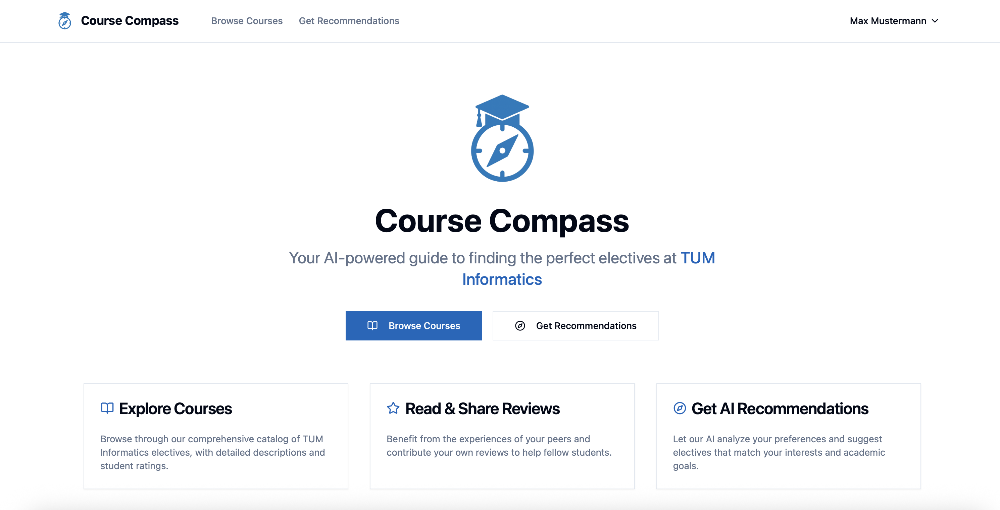
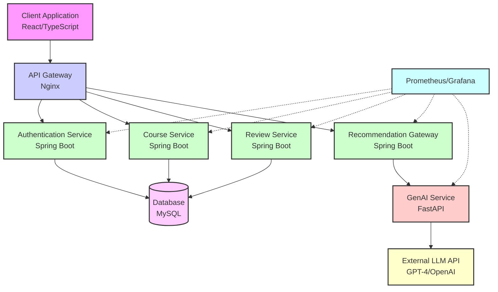
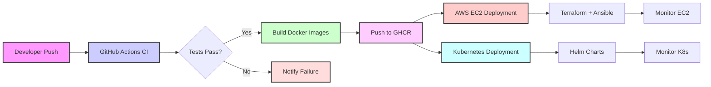

# TUM Informatics Course Recommendation System

[](https://github.com/aet-devops25/team-git-happens/actions)
[](https://docker.com)
[](https://kubernetes.io)
[](LICENSE)

An AI-driven course recommendation system designed specifically for TUM Informatics Master students. The platform combines collaborative filtering with AI-powered content analysis to provide personalized course suggestions based on student preferences, peer reviews, and curriculum requirements.



## 🎯 Project Overview

Master students in TUM Informatics face significant challenges when selecting suitable courses due to:

- **Overwhelming options**: 100+ modules across specializations (AI, Robotics, Software Engineering, etc.)
- **Lack of peer insights**: Difficulty gauging course relevance, workload, and quality
- **Complex module handbooks**: Technical descriptions that are often vague or hard to parse efficiently

Current solutions like Excel sheets and word-of-mouth recommendations lack personalization and data-driven insights.

### Our Solution

A comprehensive web-based platform that:

- **Collects user data** through TUM-ID authentication and intuitive course rating interfaces
- **Analyzes preferences** using hybrid filtering algorithms and LLM-powered content analysis
- **Generates recommendations** that balance popularity with personal relevance while adhering to TUM curriculum requirements

### Key Benefits

- **Reduces time** spent on course selection research
- **Increases satisfaction** via personalized, peer-validated suggestions  
- **Improves curriculum adherence** to TUM's degree requirements
- **Provides transparency** through community-driven reviews and ratings

## ✨ Key Features

### 🔐 Authentication System
- **JWT-based authentication** with TUM matriculation number and email login options
- **Secure password hashing** using Spring Security
- **Student profile management** with course enrollment tracking

### 📚 Course Management
- **Comprehensive course catalog** with 100+ TUM Informatics modules
- **Category-based organization** (AI, Robotics, Software Engineering, etc.)
- **Detailed course information** including credits, descriptions, and difficulty levels
- **Search and filtering capabilities** for easy course discovery

### ⭐ Review & Rating System
- **5-star rating system** for course evaluation
- **Written reviews** with structured feedback collection
- **Average rating calculation** with real-time updates
- **Student review history** and management dashboard

### 🤖 AI-Powered Recommendations
- **Hybrid recommendation engine** combining collaborative and content-based filtering
- **LLM integration** (GPT-4/LangChain) for semantic course analysis
- **RAG pipeline** for processing TUM module handbooks
- **Personalized suggestions** based on preferences and peer reviews

### 📊 Monitoring & Analytics
- **Prometheus metrics collection** across all microservices
- **Grafana dashboards** for system health and performance monitoring
- **Distributed tracing** with comprehensive logging
- **Alerting system** for proactive issue detection

## 🏗️ Architecture

### System Overview

Our course recommendation system follows a microservices architecture designed for scalability and maintainability:


### Subsystem Decomposition

The system is decomposed into focused microservices with clear responsibilities:


### Component Interactions



### Microservices Design
The system follows a microservices architecture with clear separation of concerns:

```
┌─────────────────┐    ┌─────────────────┐    ┌─────────────────┐
│   Client App    │    │  Authentication │    │  Course Service │
│   (React/TS)    │    │    Service      │    │   (Spring Boot) │
│                 │    │  (Spring Boot)  │    │                 │
└─────────────────┘    └─────────────────┘    └─────────────────┘
         │                       │                       │
         │              ┌─────────────────┐             │
         └──────────────│     Gateway     │─────────────┘
                        │     (Nginx)     │
                        └─────────────────┘
                                 │
    ┌─────────────────┐    ┌─────────────────┐    ┌─────────────────┐
    │  Review Service │    │  Recommendation │    │   GenAI Service │
    │  (Spring Boot)  │    │    Gateway      │    │   (FastAPI)     │
    │                 │    │  (Spring Boot)  │    │                 │
    └─────────────────┘    └─────────────────┘    └─────────────────┘
                                 │
                        ┌─────────────────┐
                        │  MySQL Database │
                        │     Cluster     │
                        └─────────────────┘
```

### Directory Structure
```
team-git-happens/
├── client/                     # React frontend application
│   ├── src/
│   │   ├── components/         # Reusable UI components
│   │   ├── pages/             # Route-based page components
│   │   ├── services/          # API service layer
│   │   ├── types/             # TypeScript type definitions
│   │   └── hooks/             # Custom React hooks
│   ├── Dockerfile             # Multi-stage build configuration
│   └── nginx.conf             # Reverse proxy configuration
├── server/                     # Backend microservices
│   ├── authentication-service/ # User auth & JWT management
│   ├── course-service/        # Course catalog management
│   ├── review-service/        # Rating & review system
│   └── recommendation-gateway/ # AI recommendation orchestration
├── genai-service/             # Python AI/ML service
│   ├── main.py                # FastAPI application
│   ├── ChatWebUI.py           # LLM integration layer
│   └── requirements.txt       # Python dependencies
├── helm-charts/               # Kubernetes deployment manifests
├── k8s/                       # Additional K8s configurations
├── terraform/                 # AWS infrastructure as code
├── monitoring/                # Prometheus & Grafana configuration
├── ansible/                   # Configuration management
└── docs/                      # Project documentation
```

### Technology Stack

#### Frontend
- **React 18** with TypeScript for type-safe development
- **Vite** for fast development and optimized builds
- **TailwindCSS** with Radix UI for modern, accessible components
- **React Router** for client-side routing
- **Zustand** for lightweight state management
- **React Query** for efficient server state management

#### Backend Services
- **Spring Boot 3.4** with Java 21 for robust microservices
- **Spring Security** for authentication and authorization
- **Spring Data JPA** with Flyway migrations
- **MySQL 8.0** for persistent data storage
- **JWT** for stateless authentication
- **OpenAPI/Swagger** for API documentation

#### AI/ML Service
- **FastAPI** for high-performance Python API
- **LangChain** for LLM orchestration and RAG pipelines
- **HuggingFace Transformers** for embeddings and NLP
- **FAISS** for efficient vector similarity search
- **Sentence Transformers** for semantic text analysis

#### Infrastructure & DevOps
- **Docker & Docker Compose** for containerization
- **Kubernetes** with Helm charts for orchestration
- **Nginx** for reverse proxy and load balancing
- **Prometheus & Grafana** for monitoring and observability
- **GitHub Actions** for CI/CD automation
- **Terraform** for AWS infrastructure provisioning
- **Ansible** for configuration management

## � CI/CD Pipeline

Our project implements a comprehensive CI/CD strategy with separated pipelines for different deployment targets:



### 🔧 CI Pipeline
**Purpose**: Continuous Integration - Test and Build
- **Triggers**: Push to `main`/`develop`, Pull requests
- **Actions**: 
  - Frontend tests (Jest, linting)
  - Backend tests (JUnit for all Spring Boot services)
  - Build and push Docker images to GHCR with SHA tags

### ☁️ AWS CD Pipeline
**Purpose**: Cloud deployment using Infrastructure as Code
- **Triggers**: Push to `main`/`develop`, Manual dispatch
- **Environments**: `staging` | `prod`
- **Workflow**:
  1. **Infrastructure**: Terraform provisions AWS EC2 infrastructure
  2. **Deployment**: Ansible deploys using `docker-compose.prod.yml`
  3. **Health Checks**: Automated service validation

### 🚢 Kubernetes CD Pipeline  
**Purpose**: Container orchestration deployment
- **Triggers**: Manual dispatch with environment selection
- **Actions**: Deploy to Kubernetes cluster using Helm charts
- **Features**: Rolling updates, service mesh integration, monitoring

For detailed CI/CD architecture, see [CI/CD Documentation](docs/CI_CD_ARCHITECTURE.md).

## �🚀 Installation

### Prerequisites
- **Docker & Docker Compose** (v20.10+)
- **Node.js** (v18+) for local frontend development
- **Java 21** for local backend development
- **Python 3.9+** for AI service development
- **kubectl & Helm** (optional, for Kubernetes deployment)

### Quick Start with Docker Compose

1. **Clone the repository**
   ```bash
   git clone https://github.com/aet-devops25/team-git-happens.git
   cd team-git-happens
   ```

2. **Set up environment variables**
   ```bash
   cp .env.example .env
   # Edit .env with your configuration
   ```

3. **Start the complete stack**
   ```bash
   docker-compose up -d
   ```

4. **Access the application**
   - **Frontend**: http://localhost:3000
   - **API Documentation**: http://localhost:8080/swagger-ui.html
   - **Grafana Dashboard**: http://localhost:3001 (admin/admin123)
   - **Prometheus**: http://localhost:9090

### Local Development Setup

#### Frontend Development
```bash
cd client
npm install
npm run dev          # Start development server
npm run test         # Run test suite
npm run lint         # Run ESLint
npm run build        # Create production build
```

#### Backend Development
```bash
cd server/[service-name]
./gradlew bootRun    # Start service locally
./gradlew test       # Run tests
./gradlew build      # Create JAR file
```

#### AI Service Development
```bash
cd genai-service
python -m venv venv
source venv/bin/activate  # On Windows: venv\Scripts\activate
pip install -r requirements.txt
uvicorn main:app --reload --host 0.0.0.0 --port 8000
```

## 💻 Usage

### User Registration & Authentication
1. Navigate to the registration page
2. Enter TUM matriculation number, name, email, and password
3. Login using either email or matriculation number
4. JWT token is automatically managed for authenticated sessions

### Course Discovery & Reviews
1. Browse the course catalog with filtering options
2. View detailed course information including descriptions and categories
3. Read peer reviews and average ratings
4. Submit your own reviews and ratings (authentication required)

### AI-Powered Recommendations
1. Access the recommendation page
2. Select preferred course categories
3. Specify credit preferences and additional interests
4. Receive personalized course suggestions with explanations
5. Explore recommended courses directly from results

### Common Commands
```bash
# Health check all services
curl http://localhost:3000/api/health

# Get course recommendations
curl -X POST http://localhost:3000/api/recommendation \
  -H "Content-Type: application/json" \
  -d '{
    "credits": 10,
    "categories": ["Machine Learning"],
    "description": "interested in AI and data science"
  }'

# Submit a course review
curl -X POST http://localhost:3000/api/reviews \
  -H "Content-Type: application/json" \
  -H "Authorization: Bearer YOUR_JWT_TOKEN" \
  -d '{
    "courseId": "IN2000",
    "rating": 5,
    "reviewText": "Excellent course!"
  }'
```

## 🔗 API Documentation

The TUM Course Recommendation System provides comprehensive API documentation using Swagger UI/OpenAPI. Instead of listing all endpoints in this README, you can explore the interactive API documentation directly.


*Interactive Swagger UI interface for exploring and testing API endpoints*

### Swagger UI Access

Each microservice has its own Swagger UI documentation available at:

| Service | Swagger UI URL | Description |
|---------|---------------|-------------|
| Authentication Service | [/swagger/auth/](http://compass-app.tum.de/swagger/auth/) | User registration, login, and JWT management |
| Course Service | [/swagger/course/](http://compass-app.tum.de/swagger/course/) | Course catalog management and category operations |
| Review Service | [/swagger/review/](http://compass-app.tum.de/swagger/review/) | Course rating and review system |
| Recommendation Gateway | [/swagger/gateway/](http://compass-app.tum.de/swagger/gateway/) | AI-powered course recommendations |

### Using the Interactive Documentation

1. **Explore Endpoints**: Browse available API endpoints with detailed parameter descriptions
2. **Try It Out**: Execute API calls directly from the browser interface  
3. **View Responses**: See real response examples and status codes
4. **Authentication**: Use the "Authorize" button to test authenticated endpoints
5. **Download Specs**: Export OpenAPI specifications for integration

### API Base URLs

- **Development**: `http://localhost:3000`
- **Production**: `http://compass-app.tum.de`


## 🧪 Testing

### Frontend Testing
```bash
cd client
npm test                    # Run Jest test suite
npm run test:coverage      # Generate coverage report
npm run test:e2e           # Run end-to-end tests
```

### Backend Testing
```bash
cd server/[service-name]
./gradlew test             # Run unit tests
./gradlew integrationTest  # Run integration tests
./gradlew jacocoTestReport # Generate coverage report
```

### Test Structure
- **Unit Tests**: Component/service level isolation testing
- **Integration Tests**: Database and API endpoint testing
- **End-to-End Tests**: Complete user workflow validation
- **Load Tests**: Performance and scalability validation

### Coverage Requirements
- **Minimum 80% code coverage** for all services
- **Critical path testing** for authentication and recommendations
- **API contract testing** using OpenAPI specifications

## � Monitoring & Observability

Our system implements comprehensive monitoring and observability using Prometheus, Grafana, and distributed logging to ensure system health and performance tracking.

### Metrics Collection

**Prometheus** collects metrics from all microservices with custom instrumentation:

- **Application metrics**: Request rates, response times, error rates
- **Business metrics**: User registrations, course recommendations, review submissions
- **Infrastructure metrics**: CPU, memory, disk usage, container health
- **Database metrics**: Connection pools, query performance, transaction rates

### Visualization & Dashboards

**Grafana** provides real-time dashboards for different stakeholder needs:

| Dashboard | Purpose | Key Metrics |
|-----------|---------|-------------|
| **System Overview** | High-level health monitoring | Service availability, response times, error rates |
| **Application Performance** | Deep-dive into service performance | Database queries, API latency, throughput |
| **Business Intelligence** | User engagement and system usage | Daily active users, recommendation accuracy, review trends |
| **Infrastructure** | Resource utilization and capacity | CPU/Memory usage, container health, network traffic |

### Alerting System

**Alertmanager** provides proactive issue detection with configured rules:

- **Critical alerts**: Service downtime, database connection failures
- **Warning alerts**: High response times, elevated error rates
- **Performance alerts**: Memory/CPU threshold breaches
- **Business alerts**: Unusual user activity patterns

### Access Points

- **Grafana Dashboard**: http://localhost:3001 (admin/admin123)
- **Prometheus UI**: http://localhost:9090
- **Alert Manager**: http://localhost:9093

### Health Checks

Each service exposes health check endpoints for monitoring:

```bash
# Service health endpoints
curl http://localhost:8080/actuator/health  # Course Service
curl http://localhost:8081/actuator/health  # Auth Service
curl http://localhost:8082/actuator/health  # Review Service
curl http://localhost:8083/actuator/health  # Recommendation Gateway
curl http://localhost:8000/health           # GenAI Service
```

For detailed monitoring setup and configuration, see [Monitoring Documentation](docs/Monitoring.md).

## �🔧 Configuration

### Environment Variables

#### Application Configuration
```bash
# Database Configuration
DB_PASSWORD=your_mysql_password
DB_USERNAME=your_mysql_username

# AI Service Configuration
API_KEY=your_llm_api_key
API_URL=https://your-llm-api-endpoint
MODEL=gpt-4

# AWS Configuration
AWS_ACCESS_KEY_ID=your_aws_access_key
AWS_SECRET_ACCESS_KEY=your_aws_secret_key
AWS_SESSION_TOKEN=your_aws_session_token
AWS_REGION=us-east-1

# Kubernetes Configuration
KUBECONFIG=path_to_your_kubeconfig_file

# Infrastructure Configuration
EC2_SSH_PRIVATE_KEY=your_ec2_private_key
```

#### Service Ports
- **Client**: 3000
- **Course Service**: 8080
- **Authentication Service**: 8081
- **Review Service**: 8082
- **Recommendation Gateway**: 8083
- **GenAI Service**: 8000
- **MySQL**: 3306
- **Prometheus**: 9090
- **Grafana**: 3001

### Deployment Configurations

#### Docker Compose (Local Development)
```bash
docker-compose up -d                    # Start all services
docker-compose -f docker-compose.prod.yml up -d  # Production configuration
```

#### Kubernetes (Production)
```bash
# Deploy with Helm
helm install course-app ./helm-charts/client-app
helm install auth-service ./helm-charts/authentication-service
helm install course-service ./helm-charts/course-service
helm install review-service ./helm-charts/review-service
helm install recommendation-gateway ./helm-charts/recommendation-gateway
helm install genai-service ./helm-charts/genai-service

# Apply additional configurations
kubectl apply -f k8s/unified-ingress.yaml
kubectl apply -f k8s/database-secret.yaml
```

#### AWS (Cloud Deployment)
```bash
# Infrastructure provisioning
cd terraform
terraform init
terraform plan -var-file="prod.tfvars"
terraform apply -var-file="prod.tfvars"

# Application deployment
cd ../ansible
ansible-playbook -i inventory/hosts playbook.yml
```

## 🤝 Contributing

### Development Workflow
1. **Fork the repository** and create a feature branch
2. **Follow coding standards** (ESLint for frontend, CheckStyle for backend)
3. **Write comprehensive tests** for new functionality
4. **Update documentation** for API changes
5. **Submit pull request** with detailed description

### Code Style Guidelines

#### Frontend (TypeScript/React)
- Use **functional components** with hooks
- Implement **TypeScript strict mode** for type safety
- Follow **React best practices** for component design
- Use **TailwindCSS** for consistent styling
- Write **comprehensive unit tests** with Jest and Testing Library

#### Backend (Java/Spring Boot)
- Follow **Spring Boot conventions** and annotations
- Implement **proper exception handling** with custom exceptions
- Use **DTOs** for API layer separation
- Write **integration tests** for database operations
- Document APIs with **OpenAPI/Swagger** annotations

#### AI Service (Python/FastAPI)
- Follow **PEP 8** style guidelines
- Use **type hints** for all function signatures
- Implement **async/await** for I/O operations
- Write **comprehensive docstrings**
- Use **pytest** for testing

### Pull Request Process
1. Ensure all tests pass and coverage requirements are met
2. Update relevant documentation and API specifications
3. Add appropriate labels and assign reviewers
4. Address feedback and maintain clean commit history
5. Merge only after approval from code owners

### Issue Reporting
- Use **issue templates** for bug reports and feature requests
- Include **reproduction steps** and environment details
- Add **appropriate labels** for categorization
- Reference related issues and pull requests

## 📄 License and Credits

### License
This project is licensed under the MIT License - see the [LICENSE](LICENSE) file for details.

### Copyright
Copyright (c) 2025 AET-DevOps25

### Acknowledgments
- **Technical University of Munich (TUM)** for providing the educational context and especially the Department of Computer Science.
- **Spring Boot Community** for the robust microservices framework
- **React Team** for the excellent frontend library
- **LangChain** for the powerful LLM integration capabilities
- **Prometheus & Grafana** communities for monitoring solutions

### Contributors
This project was developed as part of the TUM Advanced Engineering Technologies DevOps course. Special thanks to all team members who contributed to the design, development, and deployment of this comprehensive system.

### Third-Party Libraries
- **Spring Boot**: Apache License 2.0
- **React**: MIT License
- **LangChain**: MIT License
- **TailwindCSS**: MIT License
- **Prometheus**: Apache License 2.0
- **Grafana**: AGPL-3.0 License

---

For more detailed information, please refer to the documentation in the `/docs` directory or visit our [project wiki](https://github.com/aet-devops25/team-git-happens/wiki).
